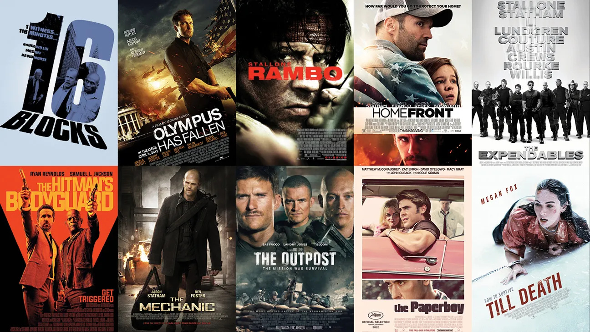

<p align="center">
  
</p>

<h1 align="center">🎬 BirgenAI Movie Recommender</h1>

<p align="center">
  <strong>A full-stack, ML-powered movie recommendation engine built with FastAPI, Next.js, and Surprise SVD.</strong>
</p>

<p align="center">
  
  
  
  
  
  
</p>

---

## ✨ Overview

**BirgenAI Movies** is a personalized movie recommendation system that predicts what you'll love based on just a handful of ratings. Rate 5+ movies in a sleek onboarding flow and get instant, tailored picks from **60,000+ titles** — powered by collaborative filtering and a trained SVD model.

### Key Features

- **Interactive Onboarding** — A beautiful step-by-step flow: browse popular movies, search by title, and rate with a single click.
- **SVD Collaborative Filtering** — Trained on the MovieLens dataset using Surprise's SVD algorithm for accurate rating predictions.
- **Nearest-Neighbor Proxy** — For new users, the system finds the most similar existing user via Pearson correlation and leverages their SVD profile.
- **Wilson Score Ranking** — Popular movies are ranked with a Wilson confidence interval, balancing rating quality with popularity.
- **Full-Stack Docker Setup** — One command (`docker compose up`) to launch both the API and the web app.

---

## 🏗️ Architecture

```
┌─────────────────────────────────────────────────────────────┐
│                        Docker Compose                       │
│                                                             │
│   ┌──────────────┐         ┌──────────────────────────┐     │
│   │  Next.js 14   │  HTTP  │     FastAPI Backend       │     │
│   │  (Port 3000)  │───────▶│      (Port 8000)          │     │
│   │               │        │                            │     │
│   │  - Onboarding │        │  - /recommend (POST)       │     │
│   │  - Star Ratings│       │  - /movies/popular (GET)   │     │
│   │  - Results     │       │  - /movies/search (GET)    │     │
│   └──────────────┘         │                            │     │
│                            │  Recommender Engine:        │     │
│                            │  ┌────────────────────┐     │     │
│                            │  │  SVD Model (.pkl)  │     │     │
│                            │  │  Movies Metadata   │     │     │
│                            │  │  Wilson Scoring    │     │     │
│                            │  └────────────────────┘     │     │
│                            └──────────────────────────┘     │
└─────────────────────────────────────────────────────────────┘
```

---

## 📂 Project Structure

```
movie-recommender/
├── docker-compose.yml          # Orchestrates API + Web containers
├── requirements.txt            # Python dependencies
├── data/                       # MovieLens dataset (not tracked in git)
│   ├── movies.csv
│   ├── train.csv
│   ├── genome_scores.csv
│   └── ...
├── models/                     # Trained model artifacts (not tracked in git)
│   └── svd_model.pkl
├── notebooks/
│   └── 01_eda.ipynb            # Exploratory data analysis
├── src/
│   ├── models.py
│   ├── api/
│   │   ├── Dockerfile          # API container definition
│   │   ├── main.py             # FastAPI app & endpoints
│   │   └── recommender.py      # SVD recommendation engine
│   └── kaggle/
│       ├── eda.py              # EDA scripts
│       ├── train_svd.py        # SVD model training
│       ├── train_hybrid.py     # Hybrid model experiments
│       └── generate_submission.py
├── submission/                 # Kaggle submission files (not tracked)
├── web/
│   ├── Dockerfile              # Frontend container definition
│   ├── package.json
│   ├── tailwind.config.js
│   ├── app/
│   │   ├── layout.tsx
│   │   └── page.tsx            # Main app entry point
│   └── components/
│       ├── OnboardingFlow.tsx   # Movie rating onboarding UI
│       └── RecommendationsPage.tsx
└── images/
    └── movies.jpg
```

---

## 🚀 Getting Started

### Prerequisites

- [Docker](https://docs.docker.com/get-docker/) & [Docker Compose](https://docs.docker.com/compose/install/)
- **Or** for local development:
  - Python 3.11+
  - Node.js 18+

### Option 1: Docker (Recommended)

```bash
# Clone the repository
git clone https://github.com/emmanuel-arch/Movie-Recommender.git
cd Movie-Recommender

# Launch both services
docker compose up --build
```

| Service | URL |
|---------|-----|
| **Frontend** | [http://localhost:3000](http://localhost:3000) |
| **API** | [http://localhost:8000](http://localhost:8000) |
| **API Docs** | [http://localhost:8000/docs](http://localhost:8000/docs) |

### Option 2: Local Development

**Backend:**

```bash
# Create and activate virtual environment
python -m venv .venv
source .venv/bin/activate  # Windows: .venv\Scripts\Activate.ps1

# Install dependencies
pip install -r requirements.txt

# Start the API server
cd src/api
uvicorn main:app --reload --port 8000
```

**Frontend:**

```bash
cd web
npm install
npm run dev
```

> **Note:** You'll need the `data/` and `models/` directories with the MovieLens dataset and trained SVD model. See the [Data & Model](#-data--model) section below.

---

## 🔌 API Endpoints

| Method | Endpoint | Description |
|--------|----------|-------------|
| `GET` | `/` | Health check — returns `{ status: "ok", model: "SVD" }` |
| `POST` | `/recommend` | Get personalized recommendations |
| `GET` | `/movies/popular?n=50` | Popular movies for onboarding |
| `GET` | `/movies/search?q=matrix&limit=10` | Search movies by title |

### Example: Get Recommendations

```bash
curl -X POST http://localhost:8000/recommend \
  -H "Content-Type: application/json" \
  -d '{
    "ratings": [
      {"movieId": 1, "rating": 5.0},
      {"movieId": 296, "rating": 4.5},
      {"movieId": 356, "rating": 3.0},
      {"movieId": 593, "rating": 4.0},
      {"movieId": 318, "rating": 5.0}
    ],
    "n": 10
  }'
```

---

## 🧠 How It Works

1. **Training** — An SVD (Singular Value Decomposition) model is trained on the [MovieLens](https://grouplens.org/datasets/movielens/) dataset using the `scikit-surprise` library, learning latent factors for users and movies.

2. **Onboarding** — New users rate 5+ movies from a curated popular list (ranked by Wilson score) or via search.

3. **Nearest-Neighbor Matching** — The system finds the existing user most similar to the new user's ratings using Pearson correlation over commonly-rated movies.

4. **Prediction** — The matched user's SVD profile is used to predict ratings for all unseen movies, returning the top-N highest predicted picks.

---

## 📊 Data & Model

This project uses the **MovieLens** dataset. The large data files and trained models are excluded from version control (see `.gitignore`).

To set up locally:

1. Download the dataset from [Kaggle](https://www.kaggle.com/competitions/cs-4641-spring-2025-movie-recommendation/data) or [GroupLens](https://grouplens.org/datasets/movielens/)
2. Place CSV files in the `data/` directory
3. Train the SVD model:

```bash
python src/kaggle/train_svd.py
```

4. The trained model will be saved to `models/svd_model.pkl`

---

## 🛠️ Tech Stack

| Layer | Technology |
|-------|-----------|
| **ML Model** | scikit-surprise (SVD), NumPy, Pandas |
| **Backend** | FastAPI, Uvicorn, Pydantic |
| **Frontend** | Next.js 14, React 18, TypeScript |
| **Styling** | Tailwind CSS 3.4 |
| **Infrastructure** | Docker, Docker Compose |

---

## 📝 License

This project is for educational and portfolio purposes.

---

<p align="center">
  Built with ❤️ by <strong>BirgenAI</strong>
</p>
